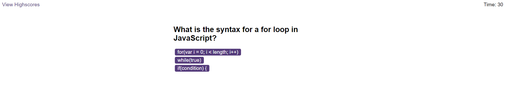

# JavaScript-Quiz-Game

## Description

This project is a coding quiz game that tests the player's knowledge of coding-related questions. The player has 60 seconds to answer as many questions as they can. Incorrect answers will penalize the player's score/time by 10 seconds.The game features a start screen, questions screen, and end screen. The start screen displays the game's title, instructions and a start button to begin the quiz. The questions screen displays the questions, multiple choice answers, and a timer. The end screen displays the player's final score and a form to enter their initials for the highscore board.

## Built With
- HTML
- CSS
- JavaScript

## Screenshot

  

## Link

## Licence 

### MIT 

Copyright <2022> <David H Jolley>

Permission is hereby granted, free of charge, to any person obtaining a copy of this software and associated documentation files (the "Software"), to deal in the Software without restriction, including without limitation the rights to use, copy, modify, merge, publish, distribute, sublicense, and/or sell copies of the Software, and to permit persons to whom the Software is furnished to do so, subject to the following conditions:

The above copyright notice and this permission notice shall be included in all copies or substantial portions of the Software.

THE SOFTWARE IS PROVIDED "AS IS", WITHOUT WARRANTY OF ANY KIND, EXPRESS OR IMPLIED, INCLUDING BUT NOT LIMITED TO THE WARRANTIES OF MERCHANTABILITY, FITNESS FOR A PARTICULAR PURPOSE AND NONINFRINGEMENT. IN NO EVENT SHALL THE AUTHORS OR COPYRIGHT HOLDERS BE LIABLE FOR ANY CLAIM, DAMAGES OR OTHER LIABILITY, WHETHER IN AN ACTION OF CONTRACT, TORT OR OTHERWISE, ARISING FROM, OUT OF OR IN CONNECTION WITH THE SOFTWARE OR THE USE OR OTHER DEALINGS IN THE SOFTWARE.

 
